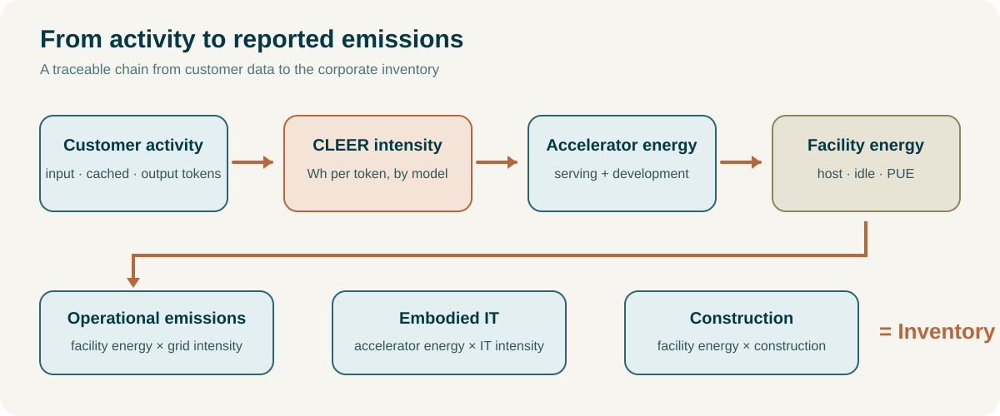
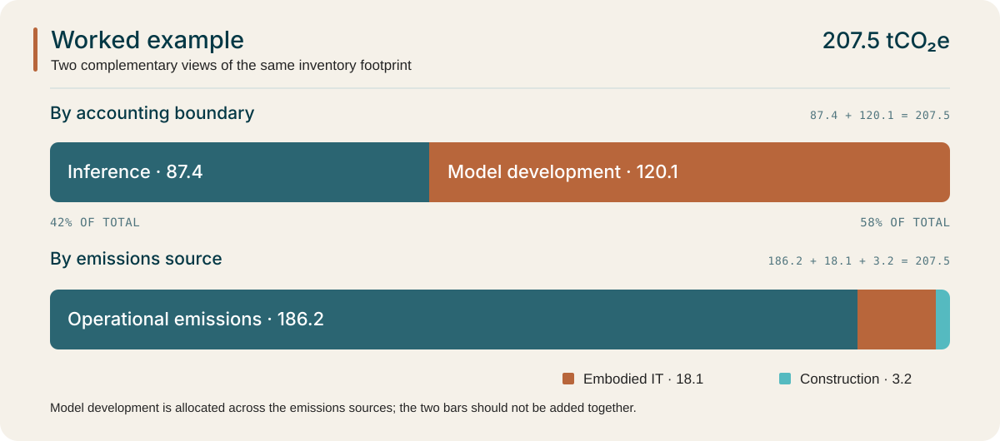

```{=html}
<div id="saig-pdf-file" hidden></div>
<div class="saig-cover" style="background: #f5f1e9 url('assets/pdf-cover-bg.png') center center / cover no-repeat;">
  <div class="saig-cover-top">
    <div class="saig-logo-card">
      
    </div>
    <h1></h1>
    <div class="subtitle"></div>
    <div class="saig-kicker"></div>

    <a class="pdf-button saig-pdf-link" href="#" target="_blank" rel="noopener noreferrer">↓ Download PDF</a>
  </div>
  <details class="saig-cite">
    <summary>Cite this report</summary>
    <div class="saig-cite-panel">
      <strong>Suggested citation</strong>
      <p>Gamazaychikov, B., Jegham, N., &amp; Luccioni, S. (2026).
        <em>Closed AI Emissions Calculation: Converting CLEER accelerator energy into greenhouse gas emissions for enterprise use of closed AI models.</em>
        Sustainable AI Group. Version CAIEC-0926.
        <a href="https://reports.sustainableaigroup.com/ai-emissions">https://reports.sustainableaigroup.com/ai-emissions</a>
      </p>
  
      <strong>BibTeX</strong>
      <pre id="saig-bibtex">@misc{saig2026caiec,
    title        = {Closed AI Emissions Calculation: Converting CLEER accelerator energy into greenhouse gas emissions for enterprise use of closed AI models},
    author       = {Gamazaychikov, Boris and Jegham, Nidhal and Luccioni, Sasha},
    howpublished = {Sustainable AI Group},
    year         = {2026},
    month        = sep,
    note         = {Version CAIEC-0926},
    url          = {https://reports.sustainableaigroup.com/ai-emissions}
  }</pre>
      <button type="button" class="saig-cite-copy"
        onclick="navigator.clipboard.writeText(document.getElementById('saig-bibtex').textContent).then(() => this.textContent = 'Copied')">
        Copy BibTeX
      </button>
  </div>
</details>  
  <div class="saig-cover-bottom">
    <div class="saig-authors"></div>

    <div class="saig-cover-meta-card">
      <div class="saig-meta-item">
        <div class="saig-meta-label">VERSION</div>
        <div class="saig-meta-value"></div>
      </div>
      <div class="saig-meta-item">
        <div class="saig-meta-label">DATE</div>
        <div class="saig-meta-value"></div>
      </div>
    </div>
  </div>
</div>
```

```{=typst}
#set page(margin: 0pt, header: none, footer: none, numbering: none)

#place(top + left, dx: 0pt, dy: 0pt)[
  #image("assets/pdf-cover-bg.png", width: 8.5in, height: 11in, fit: "cover")
]

#place(top + left, dx: 0.52in, dy: 0.66in)[
  #block(width: 3.48in, fill: white, radius: 11pt, inset: 12pt)[
    #image("assets/saig-logo.png", width: 2.96in)
  ]
]

#place(top + left, dx: 0.58in, dy: 3.00in)[
  #block(width: 7.30in)[
    #set par(justify: false, leading: 0.25em)
    #align(left)[
      #text(font: "Inter", size: 46pt, weight: "medium",
            hyphenate: false, fill: rgb("#023845"))[
        
      ]
    ]
  ]
]

#place(top + left, dx: 0.58in, dy: 4.5in)[
  #block(width: 6.90in)[
    #set par(leading: 0.35em)
    #text(font: "Source Serif 4", size: 24pt,
          hyphenate: false, fill: rgb("#242424"))[
      
    ]
  ]
]

#place(top + left, dx: 0.58in, dy: 6.2in)[
  #text(font: "DM Mono", size: 14pt, tracking: 0.8pt,
        fill: rgb("#242424"))[]
]

#place(top + left, dx: 0.58in, dy: 8.35in)[
  #block(width: 6.90in)[
    #text(font: "Source Serif 4", size: 16pt,
          hyphenate: false, fill: rgb("#242424"))[
      
    ]
  ]
]

#place(top + left, dx: 0.58in, dy: 9.20in)[
  #block(width: 7.34in, height: 0.98in, fill: white, radius: 11pt, inset: 14pt)[
    #grid(
      columns: (1fr, 1fr),
      gutter: 14pt,
      [#text(font: "DM Mono", size: 10.5pt, fill: rgb("#4F747D"))[VERSION]],
      [#text(font: "DM Mono", size: 10.5pt, fill: rgb("#4F747D"))[DATE]],
    )
    #v(5pt)
    #grid(
      columns: (1fr, 1fr),
      gutter: 14pt,
      [#text(font: "DM Mono", size: 11pt, weight: "medium", fill: rgb("#033845"))[]],
      [#text(font: "DM Mono", size: 11pt, weight: "medium", fill: rgb("#033845"))[]],
    )
  ]
]

#pagebreak()
#set page(
  margin: (top: 0.72in, bottom: 0.72in, left: 0.62in, right: 0.62in),
  header: saig-header,
  footer: saig-footer,
  numbering: none,
)

#outline(
  title: [Contents],
  depth: 1,
)

#pagebreak()

#show heading.where(level: 1): it => block(above: 16pt, below: 10pt)[
  #text(font: "Inter", size: 21pt, weight: "regular", hyphenate: false, fill: rgb("#B8663B"))[#it.body]
]
#show heading.where(level: 2): it => block(above: 13pt, below: 10pt)[
  #text(font: "Inter", size: 15pt, weight: "medium", hyphenate: false, fill: rgb("#2B6572"))[#it.body]
]
#show heading.where(level: 3): it => block(above: 13pt, below: 10pt)[
  #text(font: "Inter", size: 11.5pt, weight: "bold", hyphenate: false, fill: rgb("#DD784F"))[#it.body]
]

#show image: it => block(
  radius: 4pt,
  clip: true,
)[#it]
```

# 1. Introduction

The CLEER Technical Report estimates the accelerator energy consumed per input and output token by closed AI models [@saig2026cleer]. This document converts those estimates into greenhouse gas (GHG) emissions suitable for inclusion in a corporate inventory.

The methodology builds on existing accounting standards and published evidence. However, studies of AI emissions currently differ in their system boundaries, functional units and disclosure practices [@kim2026scoping]; introducing another stand-alone accounting method would add to this fragmentation. We therefore use established frameworks to define the accounting boundary and draw on published measurements to quantify the emissions within it:

* **The GHG Protocol Scope 3 Standard** defines the accounting boundary and allocation rules [@ghgp_scope3], while its Scope 2 Guidance governs electricity accounting [@ghgprotocol2015scope2].  
* **ITU-T L.1801** provides cut-off rules and functional units [@itu2026l1801].  
* **The Green Software Foundation's SCI for AI,** which extends ISO/IEC 21031:2024, establishes a consumer-side boundary for inference and uses tokens as the functional unit for language models. Our inference footprint follows this boundary [@gsf2025sciai].  
* Host, facility and hardware factors draw on **Google's production telemetry and life-cycle assessments** [@google2025environmental; @schneider2025tpulca] and NVIDIA's ISO 14067 product carbon footprints [@nvidia2025pcf], with each checked against independent measurements.  
* The calculation follows the overall structure of **Watershed's activity-based AI emissions framework**, which identifies model-specific energy per token as its principal missing input [@watershed2026ai].

Where sources agree, we adopt their shared estimate; where they differ, we document the range and include it in the uncertainty analysis.

The existing sources span AI hardware measurements, life-cycle assessment, data center engineering, energy systems and methane research, analyses of AI company compute spending, and carbon accounting standards. Overall, we reviewed more than 40 sources against their underlying primary data (Annex E).

Existing frameworks establish which emissions to account for, but provide few of the numerical inputs needed to estimate them for closed models. This document quantifies each factor, identifies its source and assesses the likely direction of error. The resulting calculation can be reproduced from token counts through to reported emissions, with individual factors replaced as providers release better data.

We note that AI emissions accounting remains an emerging field: serving architectures and provider disclosures evolve faster than the published research, and the evidence supporting some factors remains limited. We identify these limitations where they arise and will update the calculation as better data becomes available. All factor changes will be recorded publicly. Feedback, corrections and additional data are welcome through the public repository.

## 1.1 Accounting Problem

Companies purchasing access to hosted AI models generally have limited visibility into the infrastructure serving their requests. They typically cannot determine:

* which data center processed a request;  
* the hardware configuration used;  
* how much electricity was consumed or how it was procured;  
* the energy attributable to an individual request.

Even without these disclosures, companies need a defensible basis for estimating the associated Scope 3 emissions [@ghgp_scope3].

Our calculation uses activity data that companies can substantiate themselves. It converts usage into token counts and applies each model's estimated accelerator energy intensity. Additional factors account for:

* host equipment;  
* idle capacity;  
* facility overhead;  
* electricity carbon intensity;  
* hardware manufacturing;  
* data center construction;  
* the provider's model development.

Each material factor is documented alongside its source, evidence base, methodological status and known direction of uncertainty.

## 1.2 Relationship to the CLEER Technical Report

These two documents meet at the estimate of per-token accelerator energy. The CLEER Technical Report develops this estimate for closed models through a sequence of modelling, benchmarking and validation steps [@saig2026cleer]:

* Pruning open mixture-of-experts models to retain the components active during production inference.  
* Benchmarking the resulting models across expert parallelism configurations and batch sizes.  
* Validating benchmark results against published deployment data.  
* Matching closed models to comparable open models.  
* Using published latency figures to estimate accelerator power and energy per token.

This document takes CLEER's per-token accelerator energy estimates as inputs without repeating their derivation. Section 4 defines the handoff between the 2 methodologies, including the quantities supplied by CLEER, their system boundary and associated uncertainty, and the checks used to prevent double-counting in subsequent stages of the emissions calculation.

## 1.3 Calculation Chain

The calculation starts with the number and type of tokens a company uses with each named model. CLEER estimates the accelerator electricity needed to serve those tokens. For a corporate inventory, this report also allocates a share of the provider's model-development energy to that use.

The serving and development estimates are carried separately through the electricity calculation. Both include the energy used by surrounding server equipment and the data center. Capacity kept ready to answer requests is added only to serving, because development work does not require the same reserve.

Facility electricity is then converted into operational greenhouse gas emissions. Emissions from manufacturing IT equipment and constructing data centers are added to produce the reported inventory footprint. The figure summarizes this sequence; §10.1 gives the full equations.

{#fig-calculation-chain width=100%}

## 1.4 Adopted Factors

The table below lists the central factors used at each stage of the calculation. Later sections explain their evidence and uncertainty.

| Factor | GPU-served | TPU-served | Basis | § |
| :---- | ----: | ----: | :---- | :---- |
| Accelerator energy per token | CLEER, by model | CLEER, by model | Modelled | 4 |
| Cached-input intensity | r(m) × input intensity | r(m) × input intensity | Proxy, provider price ratio | 4.2 |
| Host uplift, h | ×1.50 | ×1.43 | Measured and published system data | 5.2 |
| Idle and provisioned capacity, i | ×1.10 | ×1.10 | Production measurement | 5.3 |
| Power usage effectiveness, p | ×1.45 | ×1.45 | Default proxy | 5.4 |
| Combined serving uplift, h × i × p | ×2.39 | ×2.28 | Calculated | 5.5 |
| Grid carbon intensity, CI | 0.41 kgCO₂e/kWh | 0.41 kgCO₂e/kWh | US lifecycle average | 6 |
| Behind-the-meter override | 0.64 kgCO₂e/kWh | 0.64 kgCO₂e/kWh | Modelled lifecycle gas generation | 6.4 |
| Embodied IT intensity, I_emb | 90 gCO₂e/kWh | 145 gCO₂e/kWh | Per kWh of accelerator energy | 7 |
| Data center construction, k_c | 7 gCO₂e/kWh | 7 gCO₂e/kWh | Per kWh of facility electricity | 8 |
| Model-development ratio, d | 1.5 | 1.5 | Sector-level proxy | 9 |
: Adopted factors. Values apply to the central calculation; sensitivities are reported in §11. {#tbl-adopted-factors-values-apply-to-the-central-calculatio tbl-colwidths="[26,20,20,30,4]"}

## 1.5 AI Terms in GHG Accounting Language


| AI term | Definition | GHG accounting analogue |
| :---- | :---- | :---- |
| Token | Unit of text processed by a model, approximately 3.5–4 characters of English text | Activity-data unit |
| Input or prompt token | Text supplied to the model | Activity data |
| Output or completion token | Text generated by the model | Activity data; typically more energy-intensive than input |
| Cached input token | Previously processed input reused by the serving system | Activity data with reduced estimated intensity (§4.2) |
| Per-token energy intensity | Accelerator electricity consumed per token for a named model, in Wh/token | Pre-carbon energy factor |
| Inference | Operation of a trained model to answer a request | Activity being accounted for |
| Model development | Compute used to create and improve models, including training, post-training, experiments, unreleased runs and research | Supplier activity allocated to customer output (§9) |
| Closed model | Model for which weights and serving configuration are not publicly available | Supplier activity for which primary operational data are unavailable |
| Accelerator | Specialized processor used for AI computation, including GPU, TPU and wafer-scale systems | Primary energy-consuming IT asset |
| Batch size | Number of requests processed concurrently by an accelerator | Serving load factor |
| Serving fleet | Machines provisioned to provide inference | Basis for idle-capacity treatment |
| Routing layer | Software that dispatches requests among multiple models | Attribution layer; emissions are assigned to underlying models |
: AI terms and their GHG accounting analogues. {#tbl-ai-terms-and-their-ghg-accounting-analogues tbl-colwidths="[20,40,40]"}

## 1.6 Evidence Basis

The calculation draws on published evidence assessed against primary sources (Annex E) and on SAIG's own empirical work, comprising the CLEER benchmarking campaign and the host-power measurements in §5.2 and Annex B. Its alignment with applicable accounting frameworks is set out in Annex C.

Where independent evidence converges, the calculation adopts the convergent value and records the supporting sources. Where credible evidence diverges, it documents the range, selects a value with a stated rationale and carries the unresolved difference into the uncertainty treatment in §11 where material. Where adequate published evidence is unavailable, direct measurement is used where feasible. Remaining gaps are treated as assumptions, proxies or limitations and disclosed accordingly.

```{=typst}
#pagebreak()
```

# 2. Scope and Boundary

## 2.1 Intended User and Services Covered

The calculation applies to an organization that uses generative AI services operated by a third party, through a vendor application, API or routing layer. The customer does not develop or operate the underlying model and has no operational control over the infrastructure used for inference. Request-level data on rack power, facility power usage effectiveness (PUE), serving location and electricity supply are assumed to be unavailable from the provider. The data hierarchies and fallback factors in later sections address this constraint.

Models trained, fine-tuned or self-hosted by the customer are out of  scope. Those activities are under the customer's operational control and belong in the applicable cloud, data center and corporate inventory methods.

Version 0926 of the calculation covers text inference, with tokens as the functional unit. The system boundary, uplift factors, embodied-emissions treatment and energy-to-carbon conversion also apply to other modalities, but the accelerator-energy factor is modality-specific– image, video and audio are future extensions.

## 2.2 Hardware Classes

Factors that vary by serving hardware are assigned to a hardware class: **TPU-served** refers to Google models served on Tensor Processing Units, which are Google’s proprietary accelerators used in their data centers. **GPU-served** refers to models served on NVIDIA Graphics Processing Units and is the default classification unless evidence supports another class. Hardware outside these classes is treated under §5.6.

## 2.3 Included Sources


| Component | Treatment | § |
| :---- | :---- | :---- |
| Serving accelerator energy | CLEER estimate per token and model [@saig2026cleer] | 4 |
| Host CPU, DRAM, NICs, storage, fans and PSU losses | ×1.50 GPU-served; ×1.43 TPU-served [@google2025environmental; @latif2025empirical; @nvidia_dgx_h100] | 5.2 |
| Idle and provisioned capacity | ×1.10; serving energy only [@google2025environmental; @oviedo2026joule] | 5.3 |
| Facility overhead | PUE; default 1.45 [@watershed2026ai; @lbnl2024datacenter] | 5.4 |
| Model development | Development ratio d applied to serving accelerator energy | 9 |
| Embodied IT hardware | Accelerator, host tray and distribution, amortized | 7 |
| Data center construction | 7 gCO₂e/kWh of facility electricity [@schneider2025tpulca] | 8 |
: Sources included in the system boundary. {#tbl-sources-included-in-the-system-boundary tbl-colwidths="[46,50,4]"}

## 2.4 Excluded Sources

A source may be excluded on materiality only where its contribution is estimated to be below **1% of operational serving emissions** and the cumulative effect of all excluded sources also remains below 1% [@itu2026l1801; @carbontrust2026video]. ITU-T L.1801 adopts the cut-off principles of ITU-T L.1410, including consideration of mass, energy, environmental significance and the cumulative effect of excluded processes [@itu2026l1801]. The 1% source-level threshold is more restrictive than the 5% threshold commonly applied to corporate Scope 3 line items and is consistent with the Carbon Trust precedent [@ghgp_scope3; @carbontrust2026video].


| Source | Estimated bound | Treatment |
| :---- | :---- | :---- |
| Downstream data storage | ~0.11% at 1-year retention [@nibler2025storage; @google2025environmental] | Excluded below materiality threshold |
| External network transmission | ~0.43% at 2020 intensity; ~0.17% at 2025 intensity [@coroama2021network; @greencoding2026co2formulas; @mytton2024network] | Excluded below materiality threshold |
| End-user devices | Not additive | Excluded to prevent double-counting in the customer's inventory |
| Hardware end-of-life | ~0.12–0.17% location-based; ~0.38% market-based [@falk2025a100; @schneider2025tpulca; @mistral2025lca] | Excluded below materiality threshold |
| **Total quantified** | **~0.71% location-based; ~0.92% market-based** | Below the 1% aggregate cut-off |
: Sources excluded from the system boundary. Derivations are in Annex A. {#tbl-sources-excluded-from-the-system-boundary-derivations tbl-colwidths="[20,40,40]"}

::: {.callout-important title="Key finding" icon=false}
The quantified exclusions sum to approximately 0.71% of operational serving emissions on a location-based basis and 0.92% on a market-based basis. Both remain below the 1% aggregate cut-off. Data center construction (§8) and hardware distribution (§7.2) exceed the source-level threshold and are included.
:::


# 3. Activity Data and Model Coverage

## 3.1 Activity Data

The calculation requires uncached input, cached input and output token counts by model:

$$T_{\mathrm{in}}(m),\ T_c(m),\ T_{\mathrm{out}}(m)=\sum \text{activity attributable to model }m$$

The preferred source is provider or customer telemetry that reports token counts directly, treated as measured activity data. Many enterprise AI tools do not expose token-level usage and report prompts, messages, conversations, active users, sessions, credits or billed work units instead. In these cases, activity is converted to tokens, or directly to accelerator energy, using a documented estimation method based on the most specific data available.


| Rung | Basis |
| :---- | :---- |
| 1 | Direct token telemetry by model |
| 2 | Token telemetry covering part of the reporting period, extended using a related usage driver available for the full period |
| 3 | Non-token usage telemetry converted to tokens with an evidenced tokens-per-unit relationship |
| 4 | Bundled or product-specific usage units converted directly to accelerator energy with a documented physical or empirical relationship |
| 5 | Reference workload or proxy data from an appropriate external dataset |
: Activity-data hierarchy. {#tbl-activity-data-hierarchy tbl-colwidths="[4,96]"}

Spend-based estimates are used only where no physical activity measure can reasonably be obtained. Public workload datasets (e.g., conversation logs, production traces, agentic workflows) provide reference workloads and are not direct measurements of a particular customer's activity.

## 3.2 Estimating Incomplete Activity

Each estimate documents the observable starting unit, the conversion relationship, the measured and estimated shares of activity, the source of any workload assumptions and the principal direction of uncertainty.

The arithmetic mean is used when converting activity units into a period total. Ratios used in a conversion, such as tokens per unit of activity or the cached share of input, are calculated as total over total, not as an average of per-request or per-user ratios. Chat and agentic reference datasets show substantial differences between representative and mean workloads, and median values understate totals for right-skewed usage.

Where the observable unit is a user-visible action, tokens per unit reflect everything sent to and generated by the model for that action, which may include accumulated conversation context, hidden system prompts, reasoning tokens and sub-agent requests. These components are included where reported or supported by an appropriate dataset, and are not added where reported token counts already contain them. Unsupported multipliers are not introduced to make an estimate more conservative.

## 3.3 Model Assignment

Activity is assigned to the model that served it where that information is available. Otherwise, assignment uses the best available evidence, which may include provider documentation, model-availability dates, known default changes, product configuration or observed model-tier information. An optional model announcement alone is not evidence that the model has become the default for all users. Where a service routes requests across several models and the routing mix is not reported, a documented proxy covers only the models available during the reporting period.

Where cache-hit telemetry is available, cached and uncached input tokens are separated. Otherwise caching follows §4.2. Cache behavior is workload- and provider-specific: a cache rate derived from an agentic workflow is not applied automatically to ordinary chat usage, and cache reuse inferred from repeated content is an upper bound, since cached entries expire between requests.

## 3.4 Model Coverage and Long-Tail Fallback

The calculation targets named-model coverage of at least 99.9% of token volume in each reporting period. Corporate AI usage often includes a long tail of models used for testing, evaluation or limited trials that together account for a very small share of volume. The 99.9% threshold is a methodological choice, not derived from an external standard, intended to limit the share of activity that depends on a generic factor.

Residual activity that cannot be matched to a named CLEER factor is assigned the highest-intensity CLEER-covered model within the same provider and tier, or, where provider or tier is unknown, the highest-intensity model in the current CLEER factor set. The fallback is a conservative bound for a small residual share, not an estimate of the unmatched model. Named-model coverage is disclosed for each reporting period.


# 4. Accelerator Energy

## 4.1 CLEER Output

CLEER estimates accelerator energy per token for a named model, with separate mean and standard-deviation values for input and output tokens [@saig2026cleer]. It covers **accelerator energy only**. Host CPU and DRAM, other server components, provisioned idle capacity, facility overhead and carbon conversion are added separately in §§5–6.

For model `m`:

$$E_{\mathrm{acc}}(m)=T_{\mathrm{in}}(m)\bar e_{\mathrm{in}}(m)+T_c(m)r(m)\bar e_{\mathrm{in}}(m)+T_{\mathrm{out}}(m)\bar e_{\mathrm{out}}(m)$$

Inputs and outputs are calculated separately because their energy intensities differ: input is processed through parallelized prefill, whereas output is generated sequentially through decode and is generally more energy-intensive per token.

## 4.2 Cached Input Tokens

A cache hit reuses key-value states generated by a previous request. This avoids part of the prefill computation, but the cached state must still be read from accelerator memory and remains part of decode-time attention, so cached input has a non-zero energy intensity.

Cache-hit energy cannot be measured for closed models because the serving implementation is not observable. The calculation uses the provider's published cache-read price ratio, r(m), as a proxy for the reduction in accelerator intensity:

$$\bar e_{\mathrm{in}}(\mathrm{cached},m)=r(m)\bar e_{\mathrm{in}}(m)$$

Cache-hit prices reported by Artificial Analysis imply cache-read-to-standard-input ratios from 0.10 to 0.50 across reviewed models [@artificialanalysis2026pricing]. Because the ratio is a price proxy and not a physical measurement, it is classified as proxy data and its direction of error is not established.

A cache write does not avoid the initial prefill computation. Cache-write tokens are treated as ordinary uncached input at ēᵢₙ(m). Where telemetry does not distinguish cache writes from uncached input, no adjustment is required.

## 4.3 TPU-Served Models

Google does not make TPU power telemetry available through an equivalent of NVIDIA's System Management Interface (`nvidia-smi`), which CLEER uses to measure GPU power during benchmarking. CLEER therefore estimates Gemini accelerator energy from Google's published accelerator-energy disclosure and documented TPU hardware characteristics. This derivation is documented in Appendix A of the CLEER Technical Report [@saig2026cleer].

## 4.4 Reasoning Modes

Reasoning levels of the same model are not treated as separate models \- reasoning level changes the amount of generation permitted rather than the per-token energy intensity of a distinct model, so additional reasoning increases emissions through the output token count, `Tₒᵤₜ`, rather than through a separate `ēₒᵤₜ`. Where provider telemetry already includes reasoning tokens within completion tokens, no additional reasoning multiplier is applied.


# 5. Facility Energy

This section converts serving accelerator energy into the electricity drawn at the facility boundary:

$$E_{\mathrm{fac}}=E_{\mathrm{acc}}hip$$

where `h` is host uplift, `i` is idle and provisioned-capacity uplift and `p` is PUE. Each factor represents a separate physical component of the system boundary. Including host power alongside accelerator power follows established practice in AI energy measurement [@strubell2019energy; @luccioni2024power].

## 5.1 Evidence for Non-Accelerator Power


| Source | Evidence basis | Implied multiplier |
| :---- | :---- | :---- |
| Google Gemini production fleet | 0.14 Wh active accelerators and 0.06 Wh host CPU and DRAM per median prompt [@google2025environmental] | ×1.43 |
| Metered 8-GPU H100 HGX node | 7.9–8.4 kW node power against 5.6 kW tray TDP under training load [@latif2025empirical] | ×1.41–1.50 |
| GB200 reference architecture | Published server and accelerator specifications [@epoch2025gb200] | ×1.53 |
| NVIDIA DGX H100 | 10.2 kW rated ceiling against 5.6 kW tray [@nvidia_dgx_h100] | ×1.82 nameplate |
| Google TPU fleet, five generations | Measured mean machine power relative to measured accelerator power over six years, all workloads [@schneider2025tpulca] | ×1.64–2.22; mean 1.88 |
: Evidence for non-accelerator power and implied host multipliers. {#tbl-evidence-for-non-accelerator-power-and-implied-host-mu tbl-colwidths="[35,55,10]"}

The adopted GPU host factor is based primarily on production and physically metered evidence. Nameplate values are retained as sensitivity bounds because they describe maximum configured power rather than normal operating power. The TPU fleet ratios cover all workloads and all hours, including host activity during low accelerator load, so the Gemini-specific serving measurement is adopted for TPU-served models.

The metered H100 range reflects accelerators operating at or near their 700 W TDP [@latif2025empirical; @nvidia_dgx_h100]. SAIG benchmarking indicates that this does not hold in serving: eight-accelerator H200 configurations averaged approximately 57% of TDP during active serving (Annex B). Accelerator draw below TDP raises the implied non-accelerator multiplier, so the adopted GPU factor is more likely to understate than overstate host energy.

Google reports data center networking as negligible for a median text prompt [@google2025environmental]. Other studies estimate central networking at approximately ×1.10 to ×1.14 above server power for relevant architectures [@oviedo2026joule; @epoch2025gb200; @microsoft2025gb200rack]. No networking uplift is applied in the central calculation; ×1.14 is retained as an upper sensitivity in §11.

Google reports 0.24 Wh per median prompt under its comprehensive boundary and 0.10 Wh under a narrower approach that counts active accelerators only and samples the most efficient 10% of data centers [@google2025environmental]. The ×2.4 ratio between them combines two effects:

$$\begin{aligned}\text{Boundary uplift}&=0.24/0.14=1.71\\\text{Facility-sample effect}&=0.14/0.10=1.40\\\text{Combined}&=2.40\end{aligned}$$

The uplift chain in this section is compared with the ×1.71 boundary uplift. The facility-sample effect is addressed through the PUE treatment in §5.4 and is not added again as a separate multiplier.

## 5.2 Host Uplift

RAPL telemetry from an eight-accelerator B300 node measures combined CPU package and DRAM power at approximately 375 W, with a coefficient of variation of 3.6% across 60 runs covering 4 models and batch sizes of 32–384 (Annex B). The term behaves as an approximately constant offset and does not vary materially with batch size. Its implied multiplier is:

$$h_{\mathrm{cd}}=1+\frac{P_{\mathrm{host}}}{N_{\mathrm{acc}}\bar P_{\mathrm{acc}}}$$

At eight accelerators, h_cd is approximately ×1.04–1.07 at accelerator TDP and ×1.09–1.12 at measured average serving power (Annex B). This component is measured, and its application to H200 and B200 assumes a comparable host platform.

CPU and DRAM do not represent the full host boundary; NICs, PSU losses, fans, storage and chassis power remain. Latif et al. report node power of ×1.41–1.50 of tray TDP under training load [@latif2025empirical]. Removing the CPU and DRAM component at H100 TDP (×1.07) leaves ×1.32–1.41 for the remaining components; the GB200 reference architecture implies ×1.43 [@epoch2025gb200]. The adopted remainder is the Latif midpoint, ×1.36, a calculated proxy based on published system measurements. The combined GPU host factor is:

$$h\approx 1.10\times1.36=1.50$$

At measured serving power, the product is approximately ×1.48–1.52 across the three benchmarked accelerator classes. A published processor-telemetry figure near ×1.08–1.11 is not a complete host uplift unless its measurement boundary also includes the remaining server components.

## 5.3 Idle and Provisioned Capacity

Serving fleets hold capacity ready to meet latency requirements. Google reports provisioned idle machines at 0.02 Wh against 0.20 Wh of active accelerator and host energy per median prompt, an uplift of ×1.10 [@google2025environmental]. Oviedo et al. model a range of ×1.05 for highly utilized fleets to ×1.20 for low-utilization fleets [@oviedo2026joule]. The present calculation adopts ×1.10 and applies it to serving energy only. CLEER's batch-size treatment applies within active serving; the idle factor covers machines that are provisioned but not actively serving.

## 5.4 Power Usage Effectiveness

PUE is the ratio of total facility electricity to IT equipment electricity.


| Rung | Basis |
| :---- | :---- |
| 1 | Facility-specific PUE where both serving site and site PUE are disclosed |
| 2 | Provider fleet-average PUE where the disclosure demonstrably covers the capacity serving the workload |
| 3 | **1.45**, the US average applied in Watershed's open AI emissions framework, derived from LBNL (2024) Figure 4.6 [@watershed2026ai; @lbnl2024datacenter] |
: Hierarchy for selecting the PUE factor. {#tbl-hierarchy-for-selecting-the-pue-factor tbl-colwidths="[4,96]"}

If a provider can specify the region/site serving the AI workload, that specific site’s PUE shall be used (rung 1). If a provider does not share this information but can guarantee that the workload is served only on first-party data centers, provider fleet-average PUE shall be used (rung 2). However, public evidence[^1] exists connecting every hyperscaler to third-party data center providers (e.g. neoclouds).

Hyperscaler fleet-average PUE values do not include third-party data centers. Therefore, no current provider disclosure is treated as satisfying rung 2, because providers may use contracted third-party capacity outside their reported owned-facility fleets. Due to this situation, rung 3 is the likely scenario unless rung 1 is satisfied.

The value of 1.45 is a proxy, not a measurement of the serving facility[^2]. Documented scenarios are 1.09 for Google's measured fleet [@google2025environmental], 1.20 for a purpose-built AI facility [@oviedo2026joule] and 1.56 for the global data center average [@uptime2024survey]. The 1.09 scenario reduces the serving chain by approximately 25%.

## 5.5 Adopted Factors


| Factor | Adopted value | Status |
| :---- | :---- | :---- |
| GPU host uplift | ×1.50 | Measured CPU and DRAM component plus documented platform remainder |
| TPU host uplift | ×1.43 | First-party production measurement |
| Idle and provisioned capacity | ×1.10 | Production measurement with independent corroboration |
| PUE | ×1.45 | Default proxy |
| **Combined GPU serving uplift** | **×2.39** | Calculated |
| **Combined TPU serving uplift** | **×2.28** | Calculated |
: Adopted factors for converting accelerator energy to facility energy. {#tbl-adopted-factors-for-converting-accelerator-energy-to-f tbl-colwidths="[35,9,56]"}

With Google's own measured PUE, the TPU chain reproduces Google's reported boundary uplift within rounding:

$$1.43\times1.10\times1.09=1.71$$

The central calculation uses the higher default PUE because serving-facility attribution is unavailable.

::: {.callout-important title="Key finding" icon=false}
The adopted host, idle-capacity and PUE factors expand accelerator energy to facility energy by **×2.39 for GPU-served models** and **×2.28 for TPU-served models**.
:::

## 5.6 Hardware Outside the Benchmarked Classes

Where serving hardware does not map to the GPU or TPU classes, the GPU token chain is not applied automatically. The energy of the vendor's billing unit is estimated from hardware-specific evidence, with accelerator inference, sandbox compute, orchestration and storage each assigned factors appropriate to their own hardware boundaries. The estimate is triangulated against a second method based on different evidence such as capacity occupancy, task-level measurements or billing economics. Right-skewed inputs use the percentile treatment in §11.1, and the record identifies the dominant unmeasured input and the provider disclosure that would replace it. A published overhead measurement that covers processor telemetry only is treated as a lower bound for full host overhead.


# 6. Electricity Carbon Intensity

Request-level serving location and electricity supply are generally unavailable to the customer – the calculation therefore applies an explicit data hierarchy. A higher rung is used where the required evidence is available, and the applicable rung is recorded by the provider.

## 6.1 Data Hierarchy


| Rung | Basis |
| :---- | :---- |
| 1\. Preferred | Region-specific grid factor where serving region is disclosed |
| 2\. Fallback | Provider-disclosed fleet-average emissions factor |
| 3\. Default | **0.41 kgCO₂e/kWh** lifecycle: eGRID2024 US national CO₂e total output rate plus upstream fuel supply [@cornerstone2026egrid; @alvarez2018methane] |
| 4\. Behind-the-meter override | **0.64 kgCO₂e/kWh** lifecycle natural-gas generation, blended across the US behind-the-meter technology mix, where documented exposure exists and actual generation data are unavailable [@holbrook2026behindthemeter; @odonoughue2014harmonization; @alvarez2018methane] |
: Hierarchy for selecting the electricity carbon-intensity factor. {#tbl-hierarchy-for-selecting-the-electricity-carbon-intensi tbl-colwidths="[15,85]"}

## 6.2 Location-Based and Market-Based Reporting

Both location-based and market-based emissions are reported. Location-based emissions are the primary inventory result because workload-level market-based electricity attributes cannot normally be verified for closed-model inference. Where the customer cannot evidence contractual electricity attributes that meet the Scope 2 quality criteria, the market-based figure equals the location-based figure and the reason is disclosed [@ghgprotocol2015scope2]. General provider renewable-energy claims do not reduce the market-based factor unless the relevant contractual instruments can be attributed to the customer's workload.

## 6.3 Default Grid Factor

All factors are stated on a lifecycle basis. The customer reports these emissions under Scope 3 Category 1, which covers the cradle-to-gate emissions of a purchased service. Upstream emissions of US grid electricity exceed the 1% threshold in §2.4 and are included.

Grid factors at rungs 1 to 3 have two components: the generation component is the eGRID CO₂e total output rate for the applicable region, and the upstream component is the fossil heat input per MWh of net generation in that region, derived from eGRID fuel-specific output and input emission rates and resource mix, multiplied by a fuel-specific upstream intensity. Natural gas uses 16.7 kgCO₂e/GJ, an author calculation combining supply-chain methane at the 2.3% leakage rate [@alvarez2018methane], converted at the AR6 GWP100 value [@ipcc2021ar6ch7], with non-methane upstream emissions [@argonne2025greet]. Coal uses 6.0 kgCO₂e/GJ and oil 12.0 kgCO₂e/GJ [@argonne2025greet]. Upstream emissions of non-fossil generation are below the §2.4 threshold and are excluded.

Applied to eGRID2024 national data, fossil heat input is 3.47 GJ/MWh of gas, 1.72 GJ/MWh of coal and 0.06 GJ/MWh of oil. The upstream component is 0.069 kgCO₂e/kWh and the rung-3 default is:

$$CI=0.341_{\text{generation}}+0.069_{\text{upstream}}=0.41\ \mathrm{kgCO_2e/kWh}$$

The generation component is the eGRID2024 US national CO₂e output rate, reconstructed using EPA's published eGRID methodology and 2024 inputs [@cornerstone2026egrid]. Transmission and distribution losses are not added, as large data centers connect at transmission voltage, where losses are below the grid-average rate; this is a simplifying assumption. US data centers are disproportionately located in regions with above-average grid carbon intensity, so the national default may understate actual serving emissions [@guidi2024datacenter].

## 6.4 Behind-the-Meter Generation

A grid-average factor is not representative where the electricity serving a facility is generated on site or through an equivalent dedicated arrangement, a situation that is [increasingly common](https://www.datacenterairpollution.com/)[^3] for most AI providers. Rung 4 applies where credible public evidence documents provider exposure to behind-the-meter gas generation and the provider does not disclose actual generation data [@cleanview_tracker]. The trigger may be supported by air permits, interconnection filings, utility filings, equipment procurement records, local reporting or other credible public evidence.

The share of provider load served behind the meter is not inferred. Where exposure is documented and no load share is available, rung 4 is applied unblended at provider level as the conservative fallback. Because conservatism is applied at this step, the rung-4 factor is set as a central estimate, not an upper bound.

The factor includes combustion CO₂, combustion CH₄ and N₂O, upstream methane leakage, other upstream supply chain emissions and plant infrastructure. Methane and nitrous oxide are converted using 100-year global warming potentials from the IPCC Sixth Assessment Report (CH₄ 29.8, N₂O 273), the basis required by the GHG Protocol [@ipcc2021ar6ch7; @ghgprotocol_gwp].

Heat rates are derived from rated manufacturer efficiencies on a lower heating value (LHV) basis and converted to higher heating value (LHV/HHV = 0.901). Combustion CO₂ is 53.06 kgCO₂/MMBtu [@epa_40cfr98_c1]. Combustion CH₄ and N₂O for turbines, and methane slip from lean-burn reciprocating engines, follow EPA AP-42 Tables 3.1-2a and 3.2-2 [@epa_ap42]. Upstream methane is calculated at the measured national supply chain leakage rate of 2.3% [@alvarez2018methane]. Other upstream emissions are calibrated so that a combustion turbine at 33% HHV efficiency and 1.3% leakage reproduces the harmonized lifecycle median of 670 gCO₂e/kWh [@odonoughue2014harmonization].

The factor is blended across the technology mix of binding behind-the-meter generation orders for US AI data centers, approximately 75 GW as of Q3 2026\. Steam turbines are treated as the bottoming cycle of combined-cycle blocks, and undisclosed capacity is assigned the fleet average [@holbrook2026behindthemeter].


| Technology | LHV efficiency | Emission factor kgCO₂e/kWh | Share of generation |
| :---- | :---- | :---- | :---- |
| Gas turbines, simple cycle | 38% | 0.70 | 35.3% |
| Reciprocating engines | 45% | 0.73 | 32.3% |
| Combined cycle (gas turbine and steam) | 55% | 0.49 | 26.0% |
| Solid oxide fuel cells | 54% | 0.49 | 5.1% |
| Other or undisclosed | Fleet average | 0.64 | 1.3% |
| **Fleet blended** | **—** | **0.64** | **100.0%** |
: Behind-the-meter technology mix and emission factors. {#tbl-behind-the-meter-technology-mix-and-emission-factors tbl-colwidths="[30,25,30,15]"}

The same method applied to a combustion turbine at 33% HHV efficiency yields 0.73 kgCO₂e/kWh at 2.3% leakage, consistent with the leakage-adjusted harmonized estimate. The difference between the two factors reflects the higher-efficiency combined-cycle and fuel cell capacity in the current behind-the-meter mix.

At the EPA inventory-implied leakage rate of 1.4%, the factor is 0.60 kgCO₂e/kWh [@alvarez2018methane]. At the 2.43% weighted average from aerial measurement of six US production regions, it is 0.65 kgCO₂e/kWh [@sherwin2024methane]. At 3.7% Permian Basin leakage, it is 0.71 kgCO₂e/kWh [@zhang2020permian]. Excluding reciprocating engine methane slip reduces the factor to 0.60 kgCO₂e/kWh. On a 20-year GWP basis, reported for context only, the factor is 0.92 kgCO₂e/kWh.

Rated efficiencies are used because they are published and verifiable. Islanded plants hold spinning reserves and follow rapid AI load fluctuations, which lowers operating efficiency below rated values [@holbrook2026behindthemeter]. A 5% relative efficiency loss would raise the factor to 0.68 kgCO₂e/kWh, so the adopted factor is more likely to understate than overstate operating emissions. The 0.64 kgCO₂e/kWh factor is a modelled proxy, not provider-specific measured generation data, and is replaced where a provider discloses verifiable generation data. Technology weights are updated as the behind-the-meter order book and operating fleet evolve.

# 7. Embodied Carbon of IT Hardware

This section estimates emissions from manufacturing and distributing serving hardware and allocates them over the hardware's operating life. Embodied hardware emissions are included because reviewed life-cycle studies place them well above the 1% materiality threshold; for instance, Mistral's production-model LCA reports hardware embodied emissions at approximately 11% of lifecycle GHG emissions [@mistral2025lca].

## 7.1 Accelerator Manufacturing

NVIDIA's ISO 14067 product carbon footprints are the primary source for GPU hardware [@nvidia2025pcf].


| Baseboard | Cradle-to-gate footprint | Per accelerator |
| :---- | ----: | ----: |
| HGX H100, 8 × H100 SXM | 1,312 kgCO₂e | 164 kgCO₂e |
| HGX B200, 8 × B200 SXM6 | 2,274 kgCO₂e | 284 kgCO₂e |
: NVIDIA accelerator-baseboard product carbon footprints. {#tbl-nvidia-accelerator-baseboard-product-carbon-footprints}

The H100 footprint is the base GPU factor: independent A100 studies report approximately 141–143 kgCO₂e per card and corroborate the general magnitude [@falk2025a100; @ademe2026gpu]. A separate ADEME parametric estimate for H100s produces approximately 235 kgCO₂e per card, around 43% above NVIDIA's value despite a narrower boundary; the divergence is attributed principally to background database selection [@ademe2026gpu]. No adjustment is made to the NVIDIA footprint because it has the stronger review and primary-data provenance, but the divergence is retained as a systematic uncertainty in §11.

For TPU-served hardware, Google's TPU life-cycle assessment reports manufacturing and transport emissions for complete machines [@schneider2025tpulca]. The calculation uses TPU v6e (Trillium), the generation CLEER assumes for Gemini serving [@saig2026cleer]: 583 kgCO₂e per TPU over the machine, of which 323 kgCO₂e is the TPU tray and 260 kgCO₂e the host share, or 4,664 kgCO₂e for an eight-TPU machine including transport.

## 7.2 Boundary Adjustments

### Host Tray

The NVIDIA footprint covers the accelerator baseboard but not the complete serving machine, which also includes CPUs, system DRAM, storage, chassis, PSUs and fans.


| Evidence | Host share |
| :---- | ----: |
| Google TPU v5e machine | 34.4% [@schneider2025tpulca] |
| Google TPU v6e machine | 44.6% [@schneider2025tpulca] |
| Boavizta/EcoLogits 8 × A100 server | 72.4% [@ecologits] |
| EcoServe | ~75% [@li2025ecoserve] |
: Evidence for the share of full-machine embodied emissions attributable to host components. {#tbl-evidence-for-the-share-of-full-machine-embodied-emissi}

The GPU factor adopts the Boavizta value of 72.4%, a host-tray uplift of ×3.62. EcoServe's approximately 75% would raise GPU embodied intensity by approximately 10% and falls within the uncertainty carried in §11. The TPU v6e machine total already includes its host tray (×1.80 over the TPU tray alone).

### Distribution

The NVIDIA footprint is cradle-to-gate and excludes the shipment of finished hardware to the data center. Published estimates imply a distribution uplift of approximately ×1.06–1.21, depending on hardware and transport assumptions [@schneider2025tpulca; @falk2025a100; @ademe2026gpu]. The calculation adopts the rounded midpoint of ×1.12 for GPU-served hardware. Distribution is already included in the Google TPU total.

## 7.3 Amortization

Embodied machine carbon is converted to an intensity per kWh of accelerator energy, the form that applies directly to CLEER output, by dividing by lifetime accelerator energy:

$$I_{\mathrm{emb}}=\frac{M}{L\times 8{,}760\times\bar P_{\mathrm{acc}}}$$

where `M` is embodied emissions per serving machine, `L` is service life in years and `P̄_acc` is the machine's average accelerator power over its installed life, including active serving and provisioned-but-idle periods.


| Step | GPU-served | TPU-served |
| :---- | :---- | :---- |
| Accelerator baseboard or tray | 1,312 kgCO₂e (HGX H100) | 2,584 kgCO₂e (8 × TPU v6e) |
| Host-tray uplift | ×3.62 | ×1.80 |
| Distribution | ×1.12 | Included |
| **Embodied carbon per machine, M** | **≈5,325 kgCO₂e** | **≈4,664 kgCO₂e** |
| Average accelerator power, P̄_acc | 2.24 kW (40% of 5.6 kW tray TDP) | 1.22 kW (8 × 153 W, measured) |
| **Embodied intensity, I_emb (3-year life)** | **≈90 gCO₂e/kWh** | **≈145 gCO₂e/kWh** |
: Embodied-hardware calculation stack and resulting intensity. {#tbl-embodied-hardware-calculation-stack-and-resulting-inte}

### Hardware Service Life

Published and practitioner assumptions range from 3 to 6 years [@schneiderelectric2023wp99; @falk2025a100; @ademe2026gpu; @ostrouchov2020gpu]. Google applies 6 years uniformly across five TPU generations as an accounting convention [@schneider2025tpulca; @jouppi2026micro]. The calculation adopts **3 years**, with a 3–6 year sensitivity range. A shorter life allocates the same manufacturing emissions across fewer lifetime accelerator kWh, so the choice is conservative; but it is not a measured mean hardware life and will be reviewed as fleet-survival evidence for H100-class and later hardware becomes available. The same life applies to both hardware classes because its evidentiary basis does not vary by accelerator vendor.

### Average Accelerator Power

For TPU-served hardware, Google reports measured mean power of 153 W per TPU v6e excluding host over the fleet [@schneider2025tpulca], which gives P̄_acc directly.

For GPU-served hardware, P̄_acc is not observable for any in-scope provider and is expressed as a share of the 5.6 kW eight-accelerator tray TDP. In SAIG benchmarking, mean accelerator power during active serving was 59% of TDP on H200, 52% on B200 and 44% on B300, measured across 388 configurations covering 16 models and batch sizes of 32–384 (Annex B). A published production case study reports GPU utilization rising from 22% to 68% after continuous batching was adopted [@spheron2026inference]. The calculation adopts 40% of TDP, with a 22–68% sensitivity range. This is below measured active-serving power on all three benchmarked classes, which is appropriate for a lifetime average that also includes idle periods. A lower average draw raises I_emb, so the choice is conservative. It is not a measured fleet average and will be reviewed when a provider discloses fleet-level accelerator utilization or lifetime energy per machine.

Survey figures reporting approximately 5% average GPU utilization across general enterprise Kubernetes clusters are not used – these describe general enterprise deployments, not frontier-model serving fleets under continuous cost pressure, and would understate P̄_acc for a population-mismatch reason (rather than due to conservatism).


| Case | GPU-served | TPU-served |
| :---- | ----: | ----: |
| Central (3 years; 40% of TDP GPU, measured TPU) | 90 g/kWh | 145 g/kWh |
| 22% of TDP | 164 g/kWh | — |
| 68% of TDP | 53 g/kWh | — |
| 100% of TDP, structural floor | 36 g/kWh | — |
| 6-year life | 45 g/kWh | 72 g/kWh |
| HGX B200 baseboard at 1,000 W TDP | 110 g/kWh | — |
: Sensitivity of embodied intensity. {#tbl-sensitivity-of-embodied-intensity}

The H100 footprint and tray TDP are used for all GPU-served models. Blackwell-class hardware has a higher embodied footprint per tray and would raise GPU embodied intensity by approximately 20%.


# 8. Data Center Construction

Google's TPU life-cycle assessment reports data center construction emissions equivalent to approximately **1.9% of location-based operational emissions** consistently across five TPU generations, which places the source above the materiality threshold [@schneider2025tpulca]. Google amortizes facility construction over 20 years and allocates it in proportion to energy use.

Dividing Google's reported construction emissions per TPU by the corresponding lifetime facility electricity (measured machine power at Google's PUE of 1.10 over six years) gives 6.9–7.0 gCO₂e/kWh across all five generations [@schneider2025tpulca]. Carbon Trust estimates are lower, principally because they use a 60-year building life; a conversion using Carbon Trust assumptions produces approximately 5.3 gCO₂e/kWh [@carbontrust2026video]. The calculation adopts:

$$k_c=7\ \mathrm{gCO_2e/kWh}=0.007\ \mathrm{kgCO_2e/kWh}$$

The factor is applied after PUE. It is expressed per unit of facility electricity because construction emissions do not vary with grid carbon intensity. It is a cross-provider proxy based on Google facilities, not a site-specific measurement.


# 9. Model Development

This section allocates a share of provider model-development energy to the customer. It covers development activity that supports the provider's model portfolio but cannot be assigned to an individual request.

## 9.1 Development Activity

Model development includes final training runs, post-training and reinforcement learning, experiments and de-risking runs, synthetic-data generation, evaluation, unreleased or failed runs and basic research. Final training runs represent a minority of this compute: Epoch AI estimates final training at 9.6% of OpenAI development compute in 2024, 22.6% for MiniMax and 12.3% for Z.ai [@epoch2025openai_experiments; @epoch2026final_runs]. SemiAnalysis estimates a laboratory-level split of approximately 50% research, 10% final training and 40% serving [@semianalysis2026allocation], meaning that a development term limited to final training would therefore omit most provider development activity.

## 9.2 Allocation Basis

Provider development energy is allocated according to the customer's share of provider output, which is measured in tokens and is therefore a physical allocation basis [@ghgp_scope3; @bashir2026amortizing]. Development energy incurred during a reporting period is allocated across output served in the same period.

The calculation does not forecast a model's lifetime output or amortize an individual training run across future use, which would require assumptions about model lifetime, future demand and total output that providers do not disclose. Period matching also avoids revising earlier reporting periods as lifetime output becomes known. This treatment addresses a corporate inventory; a product-level footprint prepared under a product standard may use a different allocation approach [@bashir2026amortizing].

## 9.3 Development Ratio

The ratio d is derived from two independent sources; both describe how frontier providers divide accelerator capacity between building models and serving requests, and neither is a direct energy measurement.


| Source | Basis | d |
| :---- | :---- | ----: |
| Epoch AI (2026) | Anthropic 2025 compute spending: \$4.1bn development compute from press reporting, against \$2.7bn serving compute implied by reported revenue of \$4.5bn and a 40% gross margin [@epoch2026compute_expenses] | 1.52 |
| SemiAnalysis (2026) | Allocation of frontier-lab accelerator capacity: 50% research and experimentation, 10% final training runs, 40% request serving; d = 60 ÷ 40 [@semianalysis2026allocation] | 1.50 |
| **Applied value** |  | **1.5** |
: Evidence supporting the default model-development ratio. {#tbl-evidence-supporting-the-default-model-development-rati tbl-colwidths="[15,80,5]"}

The two derivations rely on different evidence, a financial reconstruction in the first case and an industry compute allocation in the second. They differ by 0.019, or 1.2% of the lower estimate. The lower value is applied.

The SemiAnalysis allocation implies that final training runs account for 10 ÷ 60, or 16.7%, of development compute, with the remaining 83.3% covering research, failed runs, experimentation and unreleased models. Epoch AI's separate estimates of 9.6% to 22.6% bracket this value. A method limited to published training-compute figures would capture roughly one sixth of the development activity it is intended to measure.

The result is consistent with Watershed's framework, which reports training at 32–56% of a model's total footprint depending on assumptions [@watershed2026ai]. In the worked example in §10.2, development accounts for 58% of the inventory footprint, slightly above that range, as expected for a boundary that includes research and experimentation as well as training.

::: {.callout-important title="Key finding" icon=false}
The calculation adopts a development-to-serving accelerator-energy ratio of **1.5**, a sector-level proxy supported by two independent estimates, not a provider measurement. A provider does not receive a lower development factor solely because it publishes less information.
:::

## 9.4 Provider Classification

Corporate-level allocation is appropriate only where the provider activity being allocated is sufficiently homogeneous. For providers whose operations substantially comprise development and serving of language models, the sector-level factor applies. Diversified providers require a more granular assessment where evidence permits.

Google's published 60:40 inference-to-training split for its broader machine-learning fleet is not used as the central factor [@patterson2022goodnews] \- although first-party and energy-denominated, it covers a machine-learning estate that includes search, advertising and recommendation systems and is not representative of a frontier-model business line. It is retained as a lower-bound reference.

## 9.5 Application in the Calculation

The development ratio applies to serving accelerator energy before host and facility uplifts. For GPU-served hardware:

$$\begin{aligned}\text{Serving: }&1.50\times1.10\times1.45=2.39\\\text{Development: }&1.50\times1.45=2.18\end{aligned}$$

The idle uplift does not apply to development energy. It represents serving capacity held ready for inference latency requirements; development workloads are schedulable and are assumed not to require the same reserve.

Development energy is converted to carbon using the serving-region electricity factor because the location of the development compute is not disclosed. This is an explicit simplifying assumption, treated as a systematic uncertainty in §11.2. Embodied IT and construction apply to development activity on the same basis as serving activity.

Where a provider serves a model developed by another organization, including open-weight models, the serving provider's own development factor applies. Development energy incurred by the original model builder is not allocated where the customer has no transactional relationship or physical allocation basis with that party. Where published training-compute data permit, the excluded quantity is estimated and disclosed.

## 9.6 Measurement Basis and Direction of Error

Both sources measure the allocation of spending or capacity, not energy. Development workloads generally sustain higher accelerator utilization than serving and are typically contracted on reserved (versus on-demand) terms, so a dollar of development compute likely represents more accelerator-hours and higher average power than a dollar of serving compute. The energy-basis ratio is therefore likely higher than 1.5, and the adopted value is more likely to understate than overstate development emissions. No adjustment is made because the evidence does not quantify the conversion.

An opposing effect applies to embodied emissions. Development hardware likely operates at higher average power than the 40%-of-TDP assumption behind the central GPU embodied factor, so applying that factor to development may overstate development-related embodied emissions. Both effects are disclosed separately and are not netted.

# 10. Assembled Calculation

Except for reporting-period activity data, factors are fixed and versioned through the factor register.

## 10.1 Calculation Steps

1. **Serving accelerator energy:** $E_{\mathrm{acc}}=\sum_m [T_{\mathrm{in}}(m)\bar e_{\mathrm{in}}(m)+T_c(m)r(m)\bar e_{\mathrm{in}}(m)+T_{\mathrm{out}}(m)\bar e_{\mathrm{out}}(m)]$.
2. **Development accelerator energy:** $E_{\mathrm{dev}}=\sum_v d(v)E_{\mathrm{acc}}(v)$, with default $d=1.5$.
3. **Facility energy:** $E_{\mathrm{fac}}=E_{\mathrm{acc}}\times h\times1.10\times1.45+E_{\mathrm{dev}}\times h\times1.45$, where $h=1.50$ for GPU-served and $h=1.43$ for TPU-served models.
4. **Operational emissions:** $Op=E_{\mathrm{fac}}\times CI$, recording the provider's grid-factor rung.
5. **Construction:** $Con=E_{\mathrm{fac}}\times0.007\,\mathrm{kgCO_2e/kWh}$.
6. **Embodied IT:** $Emb=(E_{\mathrm{acc}}+E_{\mathrm{dev}})\times I_{\mathrm{emb}}$, with $I_{\mathrm{emb}}=0.090$ for GPU-served and $0.145\,\mathrm{kgCO_2e/kWh}$ for TPU-served models.
7. **Reported emissions:** $Op+Con+Emb$.

Market-based emissions are calculated and reported alongside the location-based result.

## 10.2 Worked Example

Assume serving accelerator energy of 80.3 MWh, GPU-served hardware, the rung-3 grid factor of 0.41 kgCO₂e/kWh and d = 1.5.


| Term | Calculation | Result |
| :---- | :---- | ----: |
| Development accelerator energy | 80.3 MWh × 1.5 | 120.5 MWh |
| Facility energy | 80.3 × 2.3925 + 120.5 × 2.175 | 454.2 MWh |
| Operational emissions, location-based | 454.2 MWh × 0.41 kg/kWh | 186.2 tCO₂e |
| Data center construction | 454.2 MWh × 7 g/kWh | 3.2 tCO₂e |
| Embodied IT | 200.8 MWh × 90 g/kWh | 18.1 tCO₂e |
| **Inventory footprint, location-based** |  | **207.5 tCO₂e** |
| Of which model development |  | 120.1 tCO₂e |
| **Inference footprint, location-based** | Serving component only | **87.4 tCO₂e** |
: Worked example of the assembled inventory calculation. {#tbl-worked-example-of-the-assembled-inventory-calculation}


{#fig-emissions-breakdown width=100%}

::: {.callout-important title="Key finding" icon=false}
In the worked example, the inventory footprint is 207.5 tCO₂e, 2.37 times the inference footprint. Model development contributes 120.1 tCO₂e, or 58%. Embodied IT and construction together contribute approximately 10%.
:::

## 10.3 Boundary Integrity Checks

The following controls prevent double-counting:

1. CLEER covers accelerator energy only. Host, idle and PUE factors cover separate components.  
2. The idle uplift covers provisioned machines that are not actively serving. CLEER's utilization treatment applies within active serving.  
3. Host components are IT load and are included before PUE; PUE then scales total IT load to the facility boundary.  
4. NVIDIA's footprint covers inbound material transport within cradle-to-gate. The §7.2 distribution factor covers finished-hardware shipment from gate to site.  
5. Data center construction applies to post-PUE facility electricity. IT embodied emissions apply to accelerator energy before the operational uplifts.  
6. Development energy is separate from serving energy. d is applied to serving accelerator energy before host and facility conversion.

Per-period inputs comprise token counts by model, the applicable CLEER intensity-table version and the relevant factor, activity-estimate and model-coverage register versions.

## 10.4 Inference and Inventory Footprints

The calculation produces two related footprints. The **inference footprint** represents emissions attributable to answering the customer's requests: the serving component of §§4–8, excluding allocated model development. The **inventory footprint** adds the customer's allocated share of provider model development and is the full result of §10.1.


| Use | Footprint | Basis |
| :---- | :---- | :---- |
| Corporate GHG inventory | Inventory | Includes allocated supplier development activity |
| Engineering carbon telemetry | Inference | Represents the effect associated with serving activity |
| Public model-efficiency comparison | Inference | Avoids introducing a provider-level development factor unrelated to serving efficiency |
: Footprint by reporting use. {#tbl-footprint-by-reporting-use tbl-colwidths="[30,10,60]"}

Every reported figure identifies whether it is an inference or an inventory footprint. Where the inference footprint is reported, the ratio between the two is provided where relevant; in the worked example, it is 2.37.


# 11. Uncertainty

The calculation reports a **single central estimate**. Uncertainty is reported separately and is not incorporated by replacing the central estimate with an upper-bound value. Conservative treatment is applied through factor selection and is not applied a second time by reporting the upper end of the uncertainty range as the result. Uncertainty is treated in two tracks: statistical uncertainty in the CLEER model, and systematic uncertainty from methodological choices, proxies and assumptions.

## 11.1 Statistical Uncertainty (Track 1)

For model `m`:

$$u(E_{\mathrm{acc}}(m))=T_{\mathrm{in}}(m)\sigma_{\mathrm{in}}(m)+T_c(m)r(m)\sigma_{\mathrm{in}}(m)+T_{\mathrm{out}}(m)\sigma_{\mathrm{out}}(m)$$

The retained uncertainty represents model-level calibration error, not independent query-to-query variability. Query-level dispersion would decline relative to total activity as volume increases, but calibration error has the same direction across all tokens for a model and scales linearly with volume, so the relative uncertainty σ/ē remains constant.

The correlation between CLEER errors for different models is unknown, since models share calibration sources, donor pools and methodological assumptions. The calculation therefore assumes perfect positive correlation:

$$u(E_{\mathrm{acc}})=\sum_m u(E_{\mathrm{acc}}(m))$$

The resulting range is described as an **uncertainty bound**, not a confidence interval, and no confidence percentage is assigned. Low, central and high estimates are summed directly across tools; root-sum-square aggregation is not used because it would require an independence assumption the evidence does not support.

Where underlying inputs are materially right-skewed, including relevant §5.6 hardware classes, a symmetric mean ± standard deviation may misrepresent the range. For those cases, the bounds are the **15.87th and 84.13th percentiles**, the standard normal quantiles at ±1 standard deviation, applied as a probabilistically symmetric coverage interval [@jcgm2008gum101]. A moment-matched lognormal approximation may be used where validated against simulation, with its limitations disclosed.

## 11.2 Systematic Uncertainty (Track 2)

The idle factor, PUE, data center networking treatment, grid carbon intensity, hardware service life, accelerator embodied-carbon factor, model-development ratio and material activity-estimate assumptions are treated as methodological selections rather than random variables. They are reported as discrete scenarios and are not incorporated into the Track 1 distribution. Activity-data scenarios state the share of period activity to which they apply.

The model-development factor carries three principal systematic uncertainties: compute spending is used as a proxy for energy, development energy is assigned the serving-region grid factor, and a sector-level d is used where provider-specific evidence is insufficient. Because d multiplies serving accelerator energy, error in accelerator intensity affects both serving and allocated development. These terms are correlated and are not combined as independent uncertainties.

## 11.3 Sensitivity Scenarios


| Scenario | Calculation | Change from central |
| :---- | :---- | ----: |
| Central GPU serving chain | 1.50 × 1.10 × 1.45 | — |
| Host at nameplate ceiling | 1.82 × 1.10 × 1.45 | +21% [@nvidia_dgx_h100] |
| Idle at highly utilized fleet | 1.50 × 1.05 × 1.45 | −4.5% [@google2025environmental; @oviedo2026joule] |
| Idle at low-utilization bound | 1.50 × 1.20 × 1.45 | +9% [@oviedo2026joule] |
| PUE at measured hyperscaler fleet | 1.50 × 1.10 × 1.09 | −25% [@google2025environmental] |
| PUE at purpose-built AI facility | 1.50 × 1.10 × 1.20 | −17% [@oviedo2026joule] |
| PUE at global average | 1.50 × 1.10 × 1.56 | +8% [@uptime2024survey] |
| Data center networking included | ×1.14 | +14% [@oviedo2026joule; @epoch2025gb200] |
| Hardware life of 6 years | Embodied intensity halved | ~−4% of inventory footprint |
| Compounded upper bound | 1.82 × 1.20 × 1.56 × 1.14 | +62% |
: Sensitivity of the GPU serving chain and related embodied-emissions assumptions. {#tbl-sensitivity-of-the-gpu-serving-chain-and-related-embod}

The compounded upper bound assumes that several independent factor selections are simultaneously wrong in the same direction – as such, it is a stress case, not an expected outcome.


# 12. Interpretation and Limitations

The calculation estimates GHG emissions attributable to a customer's use of third-party generative AI services over a defined reporting period. It combines customer-evidenced activity data, modelled per-token accelerator energy, measured and proxy infrastructure factors, grid or generation carbon-intensity factors, amortized hardware and facility embodied emissions, and an allocated share of provider model-development activity. It produces both location-based and market-based results.

The result is **not a direct measurement of request-level emissions**, since a customer of a closed model cannot directly observe the energy consumed by an individual request. Material quantities that remain unavailable include actual per-token accelerator energy in the provider's production fleet, the facility serving a request and its PUE, the carbon intensity of that facility's electricity, and provider development energy relative to serving energy. Where these quantities are unavailable, the calculation uses measured analogues, modelled estimates, proxies or explicit assumptions according to the hierarchies defined above.

Every such substitution is designed to be replaceable – provider disclosure of a currently unobserved quantity can replace the corresponding estimate without changing the calculation structure.

The calculation, activity estimates and registers are version-controlled together. The uncertainty treatment is reviewed whenever the CLEER intensity table or a Track 2 factor changes. It is also reviewed if model-coverage fallback exceeds 1% of reported emissions.

```{=typst}
#pagebreak()
```

# Annex A. Exclusion Evidence

## A.1 Downstream Data Storage

Provider-side storage of data supplied to or generated by an AI service is excluded. Storage controlled by the customer remains within the customer's existing cloud or IT inventory.

Provider guidance indicates that one token corresponds to approximately 3.5–4 characters of English text [@openai2026tokens; @anthropic2026glossary]. A 2,000-token exchange therefore represents approximately 7–8 kB of UTF-8 text before serialization overhead, rounded to 10 kB as a conservative assumption. Measured constant power of 3.01 W/TB for a 2.0 TB SAS HDD gives 26.4 kWh/TB-year [@nibler2025storage]. A 10 kB exchange retained for one year therefore requires approximately 2.6 × 10⁻⁴ Wh, or approximately **0.11%** of Google's measured 0.24 Wh median text prompt [@google2025environmental].

The estimate uses dedicated enterprise-drive power over a denser archival tier and the lowest credible per-prompt energy denominator identified in the reviewed literature. Both choices increase the calculated share. The exclusion is reviewed where an in-scope service has multi-year retention with no deletion policy. IEA’s estimate, that storage accounts for approximately 5% of total data center electricity, is not used because it applies across all data center workloads and does not provide a workload-specific allocation for generative AI [@iea2025energyai].

## A.2 External Network Transmission

Telecommunications infrastructure between the customer and the provider data center is excluded. Networking within the serving data center is addressed in §5.1.

For a 10 kB exchange, a composite network intensity of 0.103 kWh/GB, weighted 90% fixed and 10% mobile access across WAN, FAN and RAN segments, gives 1.0 × 10⁻³ Wh, or approximately **0.43%** of a 0.24 Wh prompt [@coroama2021network]. Extrapolated 2025 intensities from the same model give 0.04106 kWh/GB and approximately 0.17% [@greencoding2026co2formulas].

The kWh/GB factor is an allocation proxy, not a measurement of marginal network energy. Network infrastructure carries substantial load-independent energy consumption, so the marginal energy of one additional exchange is closer to zero than the factor implies [@mytton2024network]. The factor is used only to establish an upper bound supporting the exclusion and does not enter the emissions calculation.

## A.3 End-User Devices

Customer employee laptops, displays and peripherals are excluded to prevent double-counting. Their electricity is already included in the customer's inventory through Scope 2 for on-site use and Scope 3 Category 7 where applicable to remote working [@ghgp_scope3]. For text-based AI interaction, incremental device energy attributable to AI use is not separately identifiable from normal device operation. In-scope services are assumed not to perform material on-device inference; deployment of on-device inference triggers review of this boundary.

## A.4 Hardware End-of-Life

Retirement and disposal of provider-owned accelerators are excluded because their estimated GHG contribution is below the materiality threshold.


| Source | Allocation | Finding |
| :---- | :---- | :---- |
| Falk et al. A100 LCA | No-benefit substitution; no recycling credit | Disposal approximately 1.5% of embodied emissions, 2.1 kgCO₂e of 141 kgCO₂e [@falk2025a100] |
| Google TPU LCA | Avoided burden assessed but not applied | Cascaded use could offset up to 4% of embodied emissions; credit not taken [@schneider2025tpulca] |
: Evidence supporting the treatment of hardware end-of-life. {#tbl-evidence-supporting-the-treatment-of-hardware-end-of-l}

Embodied emissions represent approximately 8–11% of lifecycle emissions on a location-based basis [@jouppi2026micro; @schneider2025tpulca; @mistral2025lca], so end-of-life contributes approximately **0.12–0.17%**. Where embodied emissions reach approximately 25% under market-based accounting, end-of-life contributes approximately **0.38%** [@schneider2025tpulca].

The exclusion applies to GHG emissions only – end-of-life can be material for other impact categories, including freshwater ecotoxicity and land use [@falk2025a100], which this calculation does not assess.

## A.5 Aggregate Cut-Off Test


| Source | Location-based | Market-based |
| :---- | ----: | ----: |
| Downstream storage | 0.11% | 0.11% |
| Network transmission (2020 intensity) | 0.43% | 0.43% |
| End-of-life | 0.17% | 0.38% |
| End-user devices | Not additive | Not additive |
| **Total quantified** | **0.71%** | **0.92%** |
: Aggregate quantitative cut-off test, as a share of operational serving emissions. {#tbl-aggregate-quantitative-cut-off-test-as-a-share-of-oper}

```{=typst}
#pagebreak()
```

# Annex B. SAIG Benchmarking Data Summary Statistics

This annex reports aggregated results from SAIG's CLEER benchmarking campaign that support §5.1, §5.2 and §7.3. It reports class-level statistics only. Configuration-level data, per-model results and throughput and latency measurements are not published and are available to assurance providers and researchers on request (§B.6).

## B.1 Scope and Measurement

The data are a subset of the CLEER benchmarking campaign, which covers more than 2,400 tests across more than 20 open models [@saig2026cleer]. The subset comprises runs at an input length of approximately 100 tokens with complete power logging.


|  | Accelerator power | Host CPU and DRAM power |
| :---- | :---- | :---- |
| Instrument | NVML, per accelerator | RAPL, CPU package and DRAM domains |
| Hardware | H200, B200, B300 | Eight-accelerator B300 node |
| Models | 16 open-weight models | 4 models |
| Expert parallelism | EP1–EP8 | EP8 |
| Batch sizes | 32, 64, 128, 256, 384 | 32, 64, 128, 256, 384 |
| Input length | ~100 tokens | ~100 tokens |
| Sample | 388 configurations; 1,162 runs | 60 runs |
: Scope of the benchmarking data used in this calculation. {#tbl-scope-of-the-benchmarking-data-used-in-this-calculatio}

Each configuration is the mean of up to three runs with randomized prompt order. Power is averaged over the active serving window, excluding model load and warm-up. The median active window is 5.4 seconds. TDP values used are H200 700 W, B200 1,000 W and B300 1,100 W.

## B.2 Accelerator Power During Active Serving


| Hardware | Configurations | Models | Mean | P10 | Median | P90 |
| :---- | :---- | :---- | :---- | :---- | :---- | :---- |
| H200 | 115 | 8 | 59% | 36% | 60% | 81% |
| B200 | 178 | 13 | 52% | 31% | 49% | 78% |
| B300 | 95 | 11 | 44% | 27% | 43% | 62% |
| All | 388 | 16 | 52% | 31% | 50% | 77% |
: Average accelerator power during active serving, as a share of TDP. {#tbl-average-accelerator-power-during-active-serving-as-a-s}


| Hardware | 32 | 64 | 128 | 256 | 384 |
| :---- | :---- | :---- | :---- | :---- | :---- |
| H200 | 48% | 49% | 57% | 67% | 72% |
| B200 | 44% | 46% | 54% | 58% | 60% |
| B300 | 38% | 41% | 43% | 48% | 52% |
: Mean accelerator power by batch size, as a share of TDP. {#tbl-mean-accelerator-power-by-batch-size-as-a-share-of-tdp}

Accelerator power rises with batch size on all three classes. No benchmarked class averages 40% of TDP or less during active serving at any batch size except B300 at batch 32\.


| Hardware | Configurations | Models | Mean power per accelerator | Share of TDP |
| :---- | :---- | :---- | :---- | :---- |
| H200 | 10 | 2 | 399 W | 57% |
| B200 | 30 | 6 | 533 W | 53% |
| B300 | 30 | 6 | 486 W | 44% |
: Eight-accelerator configurations. {#tbl-eight-accelerator-configurations}

## B.3 Host CPU and DRAM Power


| Statistic | Value |
| :---- | :---- |
| Runs | 60 |
| Mean | 375 W |
| Median | 380 W |
| Standard deviation | 13 W |
| Coefficient of variation | 3.6% |
| P10–P90 | 352–388 W |
| Range | 349–394 W |
| CPU packages (two sockets), mean | 342 W |
| DRAM, mean | 33 W |
: Host CPU package and DRAM power, eight-accelerator B300 node. {#tbl-host-cpu-package-and-dram-power-eight-accelerator-b300}


| Batch size | 32 | 64 | 128 | 256 | 384 |
| :---- | :---- | :---- | :---- | :---- | :---- |
| Host power | 373 W | 374 W | 374 W | 376 W | 379 W |
: Mean host CPU and DRAM power by batch size. {#tbl-mean-host-cpu-and-dram-power-by-batch-size}

Host power varies by less than 2% across the batch range.

## B.4 Derived Quantities


| Hardware | At TDP | At measured serving power | Combined host factor at measured power (× 1.36) |
| :---- | :---- | :---- | :---- |
| H200 | ×1.07 | ×1.12 | ×1.52 |
| B200 | ×1.05 | ×1.09 | ×1.48 |
| B300 | ×1.04 | ×1.10 | ×1.49 |
: Host CPU and DRAM multiplier at eight accelerators, h_cd = 1 + 375 W ÷ (8 × P̄_acc). {#tbl-host-cpu-and-dram-multiplier-at-eight-accelerators-h-c}

The adopted GPU host factor of ×1.50 (§5.2) lies within the range at measured serving power. The adopted GPU average accelerator power of 40% of TDP (§7.3) lies below mean active-serving power on all three classes.

## B.5 Limitations

* **Measurement of benchmark conditions, not real-time production deployment:** CLEER benchmarking describes active serving at fixed batch sizes, which  are not lifetime averages and do not include idle or provisioned capacity.  
* **They measure a single, fixed input length:** all runs use an input length of approximately 100 tokens. Longer inputs increase prefill load and would be expected to raise average accelerator power.  
* The host measurement covers **one B300 node configuration** – applying it to H200 and B200 assumes a comparable dual-socket host.  
* **Thin H200 eight-accelerator sample,** which is based on 10 configurations across 2 models.  
* **Short active windows,** with a median of 5.4 seconds. Averages are stable across the three repeats, but short windows are sensitive to transients at the start and end of the window.

## B.6 Data Access

The full benchmarking dataset is available to assurance providers and research reviewers on request, subject to a data-use agreement. It includes configuration-level power, throughput and latency by model, hardware, expert parallelism and batch size.


```{=typst}
#pagebreak()
```

# Annex C. Alignment With Existing Frameworks

This annex identifies where the calculation aligns with, or differs from, published accounting and AI-sustainability frameworks. Differences reflect the accounting objective and data available to a corporate consumer of closed-model services, and are disclosed where they affect interpretation.

For an enterprise purchaser of closed-model text services, this calculation is substantially aligned with the relevant accounting boundaries and adds explicit estimation steps where supplier data are unavailable. The assessment below concerns fitness for this use case and transparency of implementation; it does not rank the frameworks or establish the accuracy of proxy factors.

| Framework | Relationship to this calculation | Added specificity or boundary distinction |
| :--- | :--- | :--- |
| GHG Protocol Scope 3 and ICT Sector Guidance | Consistent with accounting for purchased services, allocation of supplier emissions, and operational and embodied ICT emissions. | Converts model-level token activity into an inventory estimate using documented energy and carbon factors. This comparison does not assert formal conformance. |
| ITU-T L.1801 | Shares a token-based functional unit, lifecycle components, and disclosed cut-off decisions. | Focuses on a corporate GHG inventory for purchased text services; L.1801 addresses the broader environmental life cycle of an AI system. |
| GSF SCI for AI | The inference footprint overlaps its consumer-stage, per-token boundary and includes operational and embodied IT emissions. | The inventory footprint additionally allocates model development. That combined result is distinct from GSF's separate consumer and provider SCI scores. |
| Watershed AI emissions framework | Closely aligns on activity-based estimation and coverage of inference, model development, data center overhead, and embodied hardware. | Adds CLEER estimates by named closed model, a cached-token treatment, and separate statistical and systematic uncertainty analyses. Provider measurements can replace modeled factors when available. |
: Summary of alignment for corporate use of closed AI models. {#tbl-framework-summary tbl-colwidths="[20,30,50]"}

The detailed comparisons below retain the dimensions and boundary differences behind this assessment. [@ghgp_scope3; @ghgp_ict; @itu2026l1801; @gsf2025sciai; @watershed2026ai]

### GHG Protocol Scope 3 and ICT Sector Guidance

| Dimension | This calculation | GHG Protocol Scope 3 and ICT Sector Guidance |
| :--- | :--- | :--- |
| Boundary | Accelerator, host, idle, PUE, model development, embodied IT, distribution and data center construction | Purchased services; data center operational and embodied emissions |
| Functional unit | Input, cached and output tokens | Per service |
| Embodied IT | Included; 3-year central amortization | Included |
| Model development | Included; allocated by output share and reported separately as the inventory–inference difference | Not addressed for AI |
| Grid basis | Location-based primary; market-based reported alongside | Location-based and market-based |
| Uncertainty | Statistical and systematic tracks; single central result | Qualitative |
: Alignment with GHG Protocol Scope 3 and ICT Sector Guidance. {#tbl-framework-ghg-protocol tbl-colwidths="[20,40,40]"}

### ITU-T L.1801

| Dimension | This calculation | ITU-T L.1801 |
| :--- | :--- | :--- |
| Boundary | Accelerator, host, idle, PUE, model development, embodied IT, distribution and data center construction | Full AI-system lifecycle |
| Functional unit | Input, cached and output tokens | Per AI system type, including tokens for text generation |
| Embodied IT | Included; 3-year central amortization | Included |
| Model development | Included; allocated by output share and reported separately as the inventory–inference difference | Reported separately from inference |
| Grid basis | Location-based primary; market-based reported alongside | Market-based prioritized |
| Uncertainty | Statistical and systematic tracks; single central result | Transparency on sources, assumptions and omissions |
: Alignment with ITU-T L.1801. {#tbl-framework-itu tbl-colwidths="[20,40,40]"}

### GSF SCI for AI

| Dimension | This calculation | GSF SCI for AI |
| :--- | :--- | :--- |
| Boundary | Accelerator, host, idle, PUE, model development, embodied IT, distribution and data center construction | Consumer score: operation and monitoring |
| Functional unit | Input, cached and output tokens | Tokens for language models |
| Embodied IT | Included; 3-year central amortization | Included |
| Model development | Included; allocated by output share and reported separately as the inventory–inference difference | Provider score, outside the consumer score |
| Grid basis | Location-based primary; market-based reported alongside | Location-based |
| Uncertainty | Statistical and systematic tracks; single central result | — |
: Alignment with GSF SCI for AI. {#tbl-framework-gsf tbl-colwidths="[20,40,40]"}

### Watershed AI emissions framework

| Dimension | This calculation | Watershed AI emissions framework |
| :--- | :--- | :--- |
| Boundary | Accelerator, host, idle, PUE, model development, embodied IT, distribution and data center construction | Training, inference, data center overhead and embodied hardware |
| Functional unit | Input, cached and output tokens | kgCO₂e per million tokens |
| Embodied IT | Included; 3-year central amortization | Included |
| Model development | Included; allocated by output share and reported separately as the inventory–inference difference | Included |
| Grid basis | Location-based primary; market-based reported alongside | — |
| Uncertainty | Statistical and systematic tracks; single central result | Tiered by data quality |
: Alignment with Watershed AI emissions framework. {#tbl-framework-watershed tbl-colwidths="[20,40,40]"}

Sources: [@ghgp_scope3; @ghgp_ict; @itu2026l1801; @gsf2025sciai; @watershed2026ai]. "—" indicates the dimension is not specified in the published framework summary.

AFNOR Spec 2314 and ISO/IEC TR 20226:2025 provide informative guidance on AI environmental sustainability and were consulted, but do not specify accounting values at this level and are not compared here.

```{=typst}
#pagebreak()
```

# Annex D. Symbols and Units

Energy is expressed in kWh, emissions in kgCO₂e and power in W unless otherwise stated.


| Symbol | Quantity | § |
| :---- | :---- | :---- |
| m | Model in the served mix | 4 |
| v | Provider | 9 |
| Tᵢₙ(m), T_c(m), Tₒᵤₜ(m) | Uncached input, cached input and output token counts | 3 |
| ēᵢₙ(m), ēₒᵤₜ(m) | Mean CLEER accelerator energy per input and output token, Wh/token | 4 |
| σᵢₙ(m), σₒᵤₜ(m) | Standard deviation associated with those means | 4, 11 |
| r(m) | Cache-read price ratio for model m | 4.2 |
| E_acc | Serving accelerator energy for the reporting period | 4, 10 |
| d | Ratio of model-development to serving accelerator energy | 9 |
| E_dev | Model-development accelerator energy | 9, 10 |
| h | Host uplift for CPU, DRAM, NICs, storage, fans and PSU losses | 5.2 |
| i | Idle and provisioned-capacity uplift | 5.3 |
| p | Power usage effectiveness | 5.4 |
| E_fac | Facility energy | 5, 10 |
| CI | Electricity carbon intensity, kgCO₂e/kWh | 6 |
| k_c | Data center construction intensity, kgCO₂e/kWh of facility electricity | 8 |
| M | Embodied carbon of a serving machine, kgCO₂e | 7 |
| L | Hardware service life, years | 7 |
| P̄_acc | Average accelerator power over installed life | 7.3 |
| I_emb | Embodied intensity, kgCO₂e/kWh of accelerator energy | 7, 10 |
: Symbols and units. {#tbl-symbols-and-units tbl-colwidths="[20,70,10]"}

# Annex E. Sources Relied Upon

This register identifies the evidence supporting each input and distinguishes primary measurements, peer-reviewed evidence, standards, modelled studies and corroborating sources. Full references are in the bibliography.


| Source | Key | Status | Principal use |
| :---- | :---- | :---- | :---- |
| SAIG, CLEER Technical Report (2026) | @saig2026cleer | Published methodology | Per-token accelerator energy |
| Google, *Measuring the Environmental Impact of Delivering AI at Google Scale* (2025) | @google2025environmental | Published first-party fleet telemetry | Prompt-energy decomposition; host, idle and PUE evidence |
| Schneider et al. (Google), *Life-Cycle Emissions of AI Hardware* (2025) | @schneider2025tpulca | Published first-party LCA | TPU embodied carbon and power, construction, host share, distribution, end-of-life |
| Jouppi et al., *IEEE Micro* (2026) | @jouppi2026micro | Google-primary | TPU amortization convention and lifecycle split |
| Latif et al. (2025) | @latif2025empirical | Peer-reviewed, physically metered | GPU host-power range |
| Epoch AI, GB200 reference architecture (2025) | @epoch2025gb200 | Specification-derived | Host and networking corroboration |
| Choukse et al. (2025) | @microsoft2025gb200rack | Published | Server-power boundary |
| Oviedo et al., *Joule* (2026) | @oviedo2026joule | Peer-reviewed | Idle, networking and PUE scenarios |
| NVIDIA DGX H100 specification | @nvidia_dgx_h100 | Vendor-primary | Host nameplate ceiling |
| Strubell et al. (2019); Luccioni, Jernite and Strubell (2024) | @strubell2019energy; @luccioni2024power | Peer-reviewed | Accelerator-plus-host boundary precedent |
| NVIDIA HGX H100 and B200 Product Carbon Footprints (2025) | @nvidia2025pcf | ISO 14067; critically reviewed | GPU embodied carbon |
| Falk et al. (2026) | @falk2025a100 | Peer-reviewed, independent | Embodied carbon, end-of-life, distribution, lifespan |
| Lees-Perasso et al. (2026), ADEME, Hubblo and Tide | @ademe2026gpu | Published physical assessment | GPU LCA comparison, distribution, lifespan |
| Mistral AI, Carbone 4 and ADEME (2025) | @mistral2025lca | Standards-conformant LCA | Embodied lifecycle share |
| Li et al. (2025), *EcoServe* | @li2025ecoserve | Published bottom-up study | Host-tray embodied share |
| EcoLogits (GenAI Impact and Boavizta) | @ecologits | Open-source methodology | Host-tray embodied share |
| Schneider Electric, White Paper 99 (2023) | @schneiderelectric2023wp99 | Published lifecycle model | Lifespan |
| Ostrouchov et al. (2020) | @ostrouchov2020gpu | Peer-reviewed | GPU survival and lifespan |
| Spheron Network (2026) | @spheron2026inference | Vendor publication | GPU utilization sensitivity range |
| Carbon Trust (2026) | @carbontrust2026video | Expert-reviewed study | Materiality precedent; construction comparison |
| Watershed (2026) | @watershed2026ai | Published framework | Default PUE; framework alignment; training share |
| LBNL (2024) | @lbnl2024datacenter | Published | US PUE series |
| Uptime Institute (2024) | @uptime2024survey | Industry survey | Global PUE scenario |
| Cornerstone Sustainability Data Initiative (2026) | @cornerstone2026egrid | EPA-method reconstruction | Rung-3 generation factor |
| Argonne National Laboratory, GREET (2025) | @argonne2025greet | Published LCA model | Upstream fuel factors |
| Guidi et al. (2024) | @guidi2024datacenter | Published study | Data center grid-intensity comparison |
| SemiAnalysis, Holbrook et al. (2026) | @holbrook2026behindthemeter | Analyst publication | Behind-the-meter technology mix |
| O'Donoughue et al. (2014) | @odonoughue2014harmonization | Peer-reviewed harmonization | Gas lifecycle calibration |
| Alvarez et al. (2018) | @alvarez2018methane | Peer-reviewed measurement | National methane leakage |
| Sherwin et al. (2024) | @sherwin2024methane | Peer-reviewed measurement | Aerial leakage sensitivity |
| Zhang et al. (2020) | @zhang2020permian | Peer-reviewed measurement | Permian leakage sensitivity |
| EPA, 40 CFR 98 Table C-1; AP-42 | @epa_40cfr98_c1; @epa_ap42 | Regulatory emission factors | Combustion factors |
| IPCC AR6 WGI Chapter 7 (2021); GHG Protocol GWP values | @ipcc2021ar6ch7; @ghgprotocol_gwp | Assessment; standard | GWP100 values |
| Climate Power and Cleanview tracker | @cleanview_tracker | Secondary tracker | Behind-the-meter exposure |
| Nibler and Ropars (2025) | @nibler2025storage | Peer-reviewed | Storage power |
| Coroamă (2021); Green Coding IO (2026); Mytton, Lundén and Malmodin (2024) | @coroama2021network; @greencoding2026co2formulas; @mytton2024network | Published; peer-reviewed | Network intensity and marginal-energy caveat |
| OpenAI (2026); Anthropic (2026) | @openai2026tokens; @anthropic2026glossary | Provider documentation | Characters per token |
| IEA (2025), *Energy and AI* | @iea2025energyai | Published | Storage context |
| Artificial Analysis (2026) | @artificialanalysis2026pricing | Continuously updated benchmark | Cache-read price ratios |
| Epoch AI (2026), compute expenses | @epoch2026compute_expenses | Published analysis | Development-to-serving ratio |
| Epoch AI (2025, 2026), R&D compute composition | @epoch2025openai_experiments; @epoch2026final_runs | Published analysis | Final-training share |
| SemiAnalysis (2026) | @semianalysis2026allocation | Analyst interview | Laboratory compute allocation |
| Bashir et al. (2026) | @bashir2026amortizing | Peer-reviewed | Corporate versus product allocation |
| Patterson et al. (2022) | @patterson2022goodnews | Google-primary | Lower-bound development reference |
| GHG Protocol Scope 3 Standard (2011); Scope 2 Guidance (2015); ICT Sector Guidance (2017) | @ghgp_scope3; @ghgprotocol2015scope2; @ghgp_ict | Published standards | Boundary, allocation, electricity accounting |
| ITU-T L.1801 (2026) | @itu2026l1801 | International Recommendation | Cut-off and functional units |
| GSF SCI for AI (2025) | @gsf2025sciai | Published specification | Framework alignment |
| Kim, Yoo and Chung (2026) | @kim2026scoping | Peer-reviewed review | Evidence of boundary inconsistency |
| JCGM 101:2008 | @jcgm2008gum101 | International guide | Coverage-interval convention |
: Sources relied upon and their principal uses. {#tbl-sources-relied-upon-and-their-principal-uses tbl-colwidths="[25,30,20,25]"}

[^1]:  Examples of hyperscaler-neocloud exposure evidence: [Microsoft Azure](https://www.bloomberg.com/news/articles/2025-11-04/microsoft-neocloud-deals-cross-60-billion-in-ai-spending-frenzy), [Google Cloud](https://www.forbes.com/sites/iainmartin/2026/09/03/a-tiny-startup-helping-google-take-on-nvidia-is-now-worth-18-billion/), [Amazon Web Services](https://finance.yahoo.com/technology/ai/articles/prediction-amazon-ceo-andy-jassy-104500880.html), [Meta](https://nebius.com/newsroom/nebius-signs-new-ai-infrastructure-agreement-with-meta), [Oracle](https://www.crusoe.ai/resources/newsroom/crusoe-announces-flagship-abilene-data-center-is-live)

[^2]:  LBNL's series reaches approximately 1.43 in 2023, and its 2024 scenarios range from approximately 1.33 to 1.45 [@lbnl2024datacenter]. The adopted value is at the upper end of that range and keeps this calculation directly aligned with Watershed's framework.

[^3]: Every AI provider and hyperscaler has some documented exposure to behind-the-meter gas generation.
